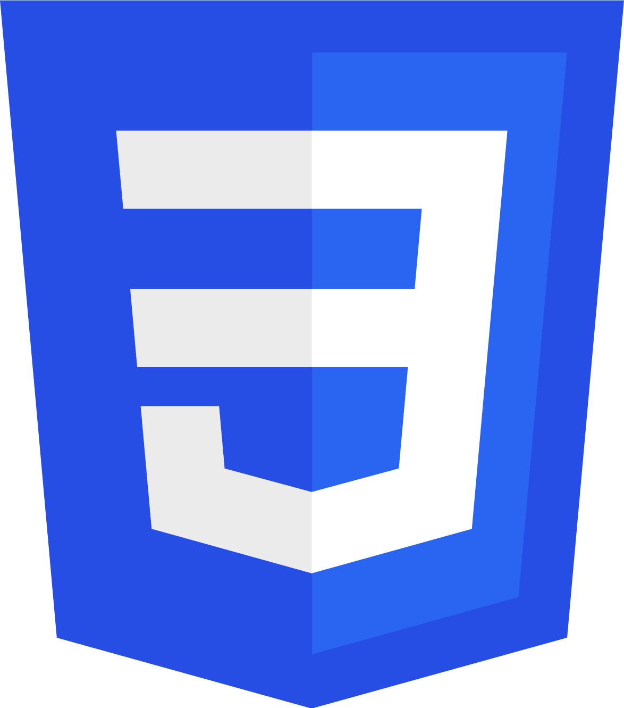

<h1>
  
  Hi, I'm Iram Diaz
  
</h1>
<h2>A passionate gopher and hardware hobbyist from Mexico</h2>
<h3> About me:</h3>

&nbsp;:man_technologist: &nbsp;Currently working as a Freelancer.\
&nbsp;:seedling: &nbsp;Love for hardware and automation. \
&nbsp;:heart: &nbsp;Passionate with problem solving and open source. \
&nbsp;:book: &nbsp;Currently researching machine learning and blockchain. \
&nbsp;:bird: &nbsp;Find me in my <a href="https://twitter.com/halpadh">Twitter</a>

<h3>Languages:</h3>

  
  
  
  
  
  
  

<h3>Technologies:</h3>

  
  
  
  
  
  
  
  
  
  

